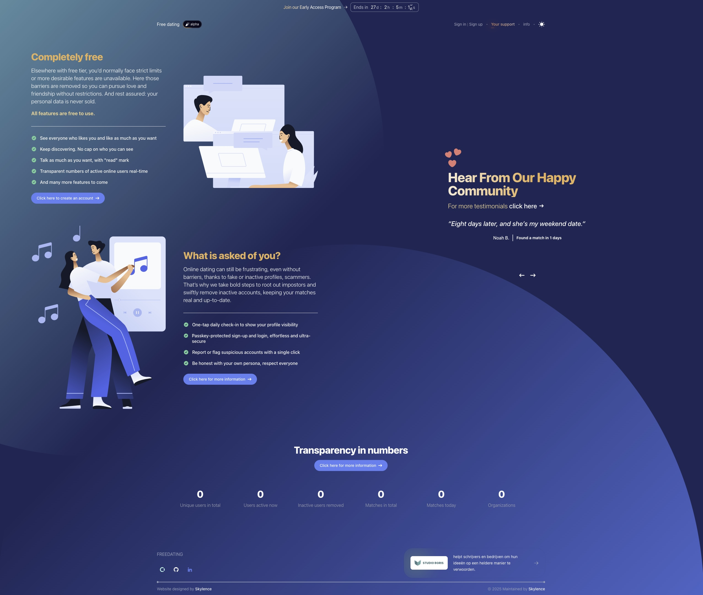

## Free online dating platform

A high‐level overview of this project, outlining its goals, core features, and technology choices. This is intended as a
reference for developers joining the team or exploring the codebase.

> **For developers**, [go here for technical documentation](docs/README.md)

---

### Table of Contents

1. [Project Vision](#project-vision)
2. [Guiding Principles](#guiding-principles)
3. [Core Features](#core-features)

    * [Authentication & Security](#authentication--security)
    * [Location & Activity](#location--activity)
    * [Matching & Browsing](#matching--browsing)
    * [Messaging & Communication](#messaging--communication)
    * [User Experience Enhancements](#user-experience-enhancements)
4. [Technology Stack](#technology-stack)

    * [Backend](#backend)
    * [Frontend / Livewire](#frontend--livewire)
    * [Search & Discovery](#search--discovery)
    * [Real-Time & Notifications](#real-time--notifications)
    * [Optional & Future Integrations](#optional--future-integrations)
5. [Data Models & Matching Logic](#data-models--matching-logic)
6. [Additional Pages & Documentation](#additional-pages--documentation)
7. [Handling Abuse & Moderation](#handling-abuse--moderation)
8. [Scalability & Performance Notes](#scalability--performance-notes)
9. [Next Steps & Roadmap](#next-steps--roadmap)

---

## Project Vision

Most commercial dating apps intentionally slow down or frustrate user engagement—paywalls, opaque algorithms, and “match
scores” designed to keep people scrolling. This project seeks to:

* **Eliminate artificial throttling.** No hidden paywalls, no retroactive limits on likes, no algorithmic “Elo scores.”
* **Prioritize genuine connection.** Only active, verified users participate—no ghost accounts, no bots.
* **Promote transparency.** Real-time location, clear matching rules, and straightforward UI/UX without manipulative
  design.

This is primarily a **learning exercise** and **technical showcase** using Laravel Livewire. If the final performance is
insufficient at scale, we may later migrate to a frontend framework like Next.js or Nuxt.js.

---

## Guiding Principles

1. **No hidden algorithms or rankings.**

    * Users see exactly who they’ve liked, who has liked them, and mutual matches—without a proprietary “attractiveness
      score.”

2. **WebAuthn for authentication.**

    * Leverage passkeys (FIDO2/WebAuthn) for login/registration to minimize fake accounts and bots.

3. **Precise, real-time location.**

    * Enforce GPS-level accuracy to prevent VPN or location spoofing.

4. **Active user focus.**

    * Only users who have recently engaged with the platform (e.g., liked, browsed, messaged) appear in other users’
      feeds.

5. **Mutual-only matching lock.**

    * Once User A and User B match, they cannot like anyone else until one of them “breaks up.”
    * Prevents “like back” bypass: If User A already likes User C, then C cannot like back until A’s existing match is
      ended.

6. **Transparent, real-time messaging.**

    * “Destructive” chat: messages are only visible while both users remain matched. Once a match ends, chat history is
      purged.

---

## Core Features

### Authentication & Security

* **WebAuthn / Passkeys**

    * Users register/login via FIDO2 devices, platform authenticators, or security keys.
    * Minimizes stolen passwords, phishing, and account-takeover risk.

* **Email Verification & Password Fallback**

    * Classic email/password registration as a backup.
    * Email verification flow (optional for passkey-only users).

* **(Future) Third-Party Verification**

    * Potential integration with Itsme (or similar) for identity checks—depending on cost/feasibility.

---

### Location & Activity

* **Mandatory GPS location**

    * Each user’s true geolocation is captured (via browser or mobile GPS).
    * No VPN/spoofing: location must meet accuracy thresholds before browsing or matching.

* **Active‐Only Visibility**

    * Users who haven’t liked, chatted, or browsed in the last 48 hours are temporarily hidden.
    * Encourages continual engagement and reduces ghost-user clutter.

---

### Matching & Browsing

* **No Black-Box Algorithms**

    * Browse all available, active, and location-proximate profiles in a simple grid or list.
    * No “smart sort,” “ranking,” or “Elo” behind the scenes.

* **Meilisearch (or TypeSense) via Laravel Scout**

    * Full-text search on profile fields (interests, bio, tags).
    * Faceted filters (age range, gender preference, distance radius).

* **Mutual Match Lock**

    * When A likes B and B likes A, they become a “locked match.”
    * Neither can like anyone else until the match is explicitly broken by one party.

---

### Messaging & Communication

* **Destructive Chat**

    * Messages persist only for the lifetime of the match.
    * If User A or B unmatches, all exchanged messages are deleted.

* **Icebreaker Prompts**

    * When a new chat opens, pre-built “icebreaker” questions or conversation starters appear.
    * Helps avoid awkward silences and keeps engagement high.

* **(Future) WebRTC Integration**

    * Voice or video calls within the browser/mobile—no external apps.
    * Peer-to-peer media via Laravel broadcasting or a TURN/STUN server.

* **Real-Time Notifications**

    * Use \[Laravel WebSockets / Reverb] to push new likes, matches, and messages instantly.

---

### User Experience Enhancements

* **Intuitive, Livewire-Powered UI**

    * Dynamic, server-driven components minimize JavaScript complexity.
    * Blade views focus on layout and design only.

* **Transparent “Break Up” Flow**

    * Clear UI for ending a match.
    * Upon unmatching, both parties see a confirmation and chat history disappears.

* **Profile Completeness Meter** (optional)

    * Encourage users to fill out bio, add photos, set preferences.
    * Light UX nudge, not a “score” that gates functionality.

---

## Technology Stack

### Backend

* **Laravel 12.x**

    * Core framework for routing, Eloquent ORM, database migrations, etc.

* **PostgreSQL**

    * Depending on hosting environment (MAMP has no postgres).

* **Laravel Sail / Docker** (dev)

    * Containerized development environment.
    * Valkey (Redis alternative) for caching/queue in Sail.

* **Herd (Free & Pro) / MAMP Pro** (macOS dev)

    * Native PHP/Postgres or Apache/MySQL stacks.

---

### Frontend / Livewire

* **Blade + Livewire**

    * Real-time components without building a separate SPA.
    * Leverages server-side rendering for initial load + minimal JS complexity.

* **Flowbite + Custom Theme**

    * Reusable UI components (buttons, navigation, forms, modals).
    * Custom Blade layouts for branding and UX consistency.

---

### Search & Discovery

* **Laravel Scout**

    * Abstract layer to integrate various search engines.

* **Meilisearch** (or **TypeSense**)

    * Blazing-fast, typo-tolerant search for profiles.
    * Used for full-text queries, filtering, and faceting.

---

### Real-Time & Notifications

* **Laravel WebSockets (Laravel Reverb)**

    * Self-hosted WebSocket server for broadcasting events.
    * Push notifications: new likes, matches, chat messages in real time.

* **Event Broadcasting**

    * Laravel’s native broadcasting (Pusher protocol) to notify the front end.

---

### Optional & Future Integrations

* **WebAuthn (FIDO2)**

    * Leverage the [spatie/laravel-passkeys](https://github.com/spatie/laravel-passkeys) package for full passkey flows.

* **WebRTC**

    * Peer-to-peer audio/video calls.
    * Might require a TURN/STUN server or a third-party service like Twilio.

* **Itsme or Other KYC Providers**

    * For commercial identity verification (e.g., Belgian Itsme).
    * Evaluate pricing and API reliability before full integration.

---

## Data Models & Matching Logic

1. **Users** (`users` table)

    * Standard Laravel authentication fields (`email`, `password`, etc.)
    * Passkey columns (`webauthn_credentials`, etc.) if using WebAuthn.
    * Profile completeness flags, location data (`latitude`, `longitude`, `last_active_at`).

2. **Profiles** (`profiles` table; one-to-one)

    * Extended bio, interests, age, gender, preferences, photos (JSON or related table).
    * Indexable fields for Meilisearch (e.g., `bio`, `tags`, `city`, `state`).

3. **Likes** (`likes` table)

    * `liker_id` → `likee_id`; timestamp for when the “like” occurred.
    * Unique constraint on `(liker_id, likee_id)`.

4. **Matches** (`matches` table)

    * Created when User A and B mutually like each other.
    * Fields: `user_a_id`, `user_b_id`, `created_at`, `status` (active/ended).
    * Enforce rule: once matched, neither party can initiate another “like” until they unmatch.

5. **Messages** (`messages` table)

    * `match_id` foreign key, `sender_id`, `body`, `created_at`.
    * On “unmatch,” cascade delete all messages for that `match_id`.

6. **Icebreakers** (`icebreakers` table; optional)

    * Predefined prompts to help start a conversation.
    * Each message is inserted when a new match is created.

---

## Additional Pages & Documentation

* **Security Center**

    * Guides on safe swiping, reporting abuse, managing privacy settings (e.g., “hide from searches”).
    * Explains how location data is used & stored.

* **FAQ & Legal**

    * Standard “Frequently Asked Questions” page (livewire or static blade).
    * Terms of Service & Privacy Policy (legal requirements).

---

## Handling Abuse & Moderation

1. **User Reporting**

    * Users can report profiles or chats from within the match or profile view.
    * “Reports” table logs `reporter_id`, `reported_user_id`, `reason`, `details`, `created_at`.

2. **Anti-Spam / Automated Checks**

    * Basic rate limiting: no more than X likes per minute/hour.
    * Re‐use Laravel’s throttling middleware (or a custom solution) to prevent bots.

3. **Dirty Content / Inappropriate Photos**

    * Flagging system: if a photo is flagged by multiple users, it’s automatically hidden pending review.
    * (Future) Third-party image moderation API (e.g., Google Vision SafeSearch or a paid service).

4. **Scammer / Bad Intent Users**

    * If a user is flagged > N times, temporarily suspend or require identity verification via Itsme / KYC.
    * Admin dashboard (in a “Core/Admin” module) to review flags and enforce bans.

---

## Scalability & Performance Notes

* **Livewire & Server Rendering**

    * Livewire keeps most logic server‐side, but may require careful caching of components (with `@cache`).
    * Limit excessive reactivity on high-traffic pages (e.g., browsing thousands of profiles).

* **Search Engine**

    * Meilisearch can be self-hosted or run in a managed cluster for production.
    * For very large data sets (> 1M profiles), consider sharding or switching to TypeSense.

* **WebSockets**

    * Use a dedicated server (Soketi/laravel-websockets) behind a load balancer.
    * Horizontal scaling: ensure sticky sessions or Redis as the WebSocket broadcaster.

* **Geohashing / Proximity Queries**

    * For location-based browsing, use a geospatial index (latitude/longitude) or a geohash column.
    * Meilisearch supports radius filters, but for extremely high traffic, move to a specialized geospatial database
      like PostGIS.

* **Resource Cleanup**

    * Periodic jobs to delete expired matches, messages, or flagged content.
    * Laravel’s scheduler (cron) handles daily pruning tasks.

---

## Next Steps & Roadmap

1. **Finalize Core MVP**

    * Registration & login flows (Classic + WebAuthn).
    * Basic profile creation and browsing.
    * Mutual match logic and destructive messaging.

2. **Deploy Search & Real-Time**

    * Meilisearch integration with Laravel Scout.
    * WebSocket server (Soketi / Reverb) for instant notifications.

3. **User Reporting & Moderation**

    * Build admin dashboard to handle flags, bans, and content review.
    * Integrate basic image moderation API for profile photos.

4. **User Engagement Features**

    * Icebreaker questions library + UI.
    * In-app notifications (e.g., via Toasts or a dropdown).

5. **(Optional) Voice/Video Calling**

    * Prototype WebRTC inside a Livewire dialog.
    * Evaluate TURN/STUN server solutions or third-party SDKs.

6. **Identity Verification (Itsme or KYC)**

    * Research pricing and API reliability.
    * Add an optional “verified user” badge for higher trust.

7. **Performance Audit & Scaling Plan**

    * Load test browsing and match flows.
    * Adjust MySQL/Postgres indexing, caching layers, and server resources.

---

**Note**: This project is a learning exercise—a demonstration of building a complex, real-time application with Laravel
Livewire. If the codebase’s performance becomes a bottleneck at scale, consider migrating critical user-facing flows (
browsing, chatting) to a dedicated frontend framework like Next.js or Nuxt.js, backed by Laravel APIs.

#### Current homepage

