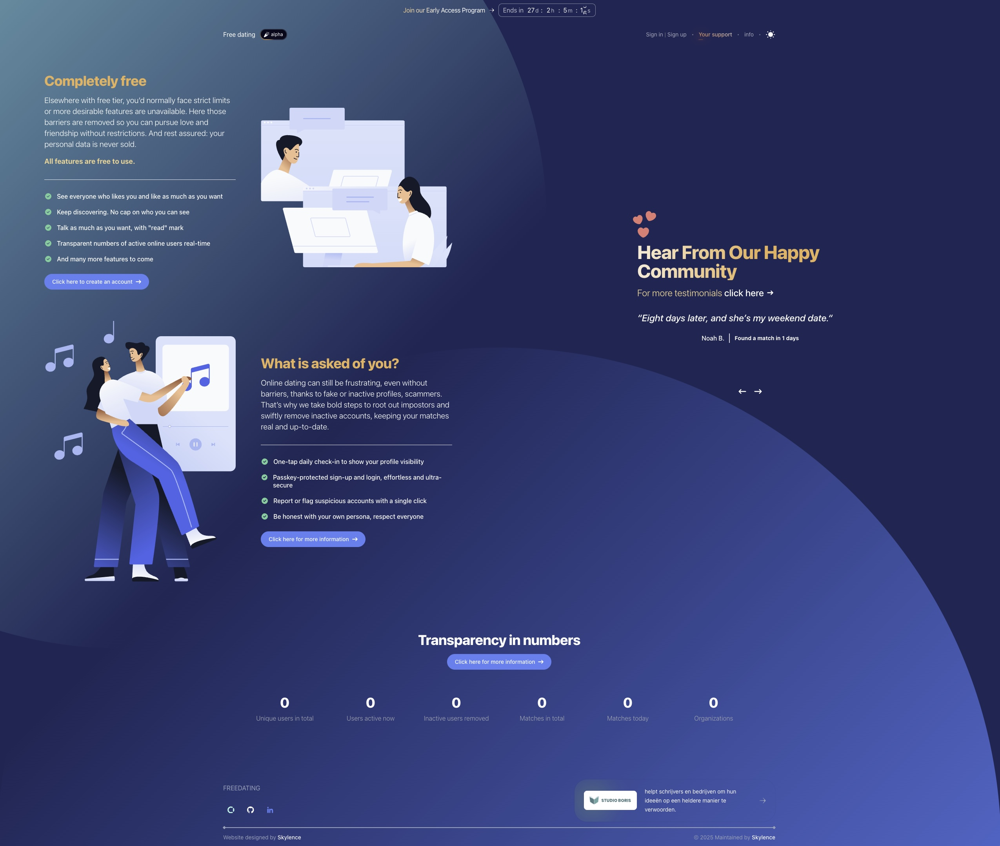
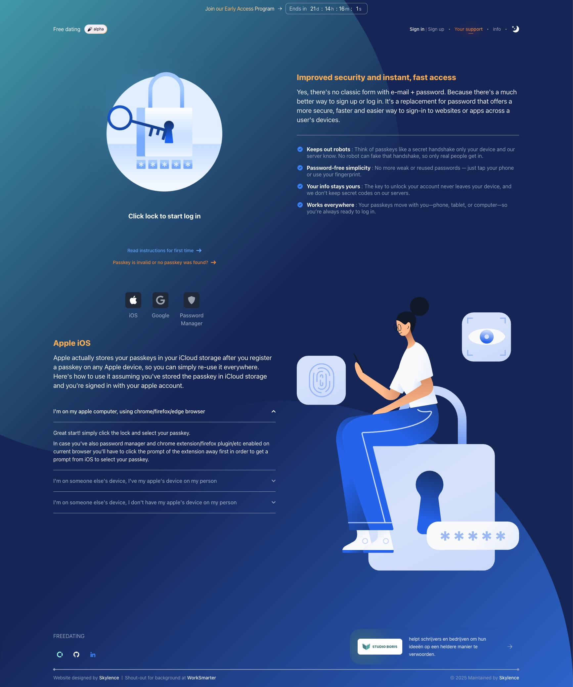
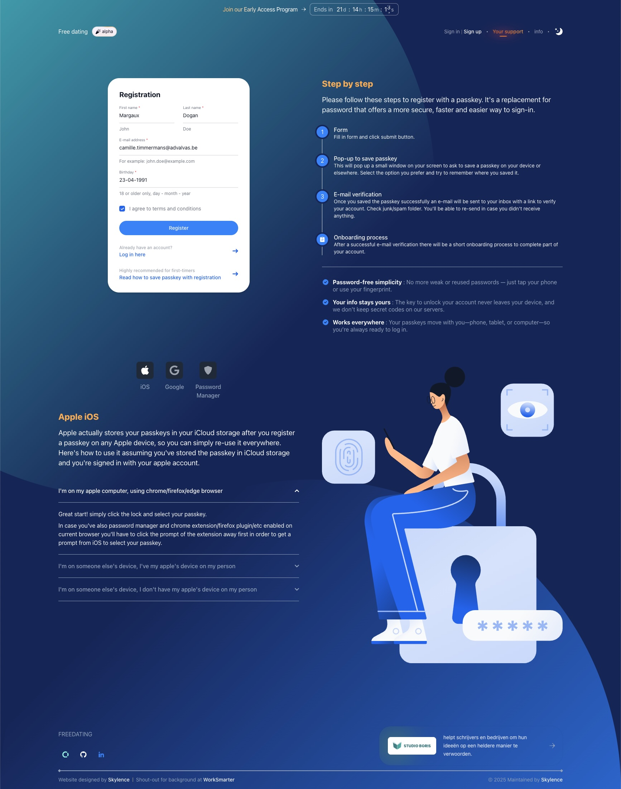
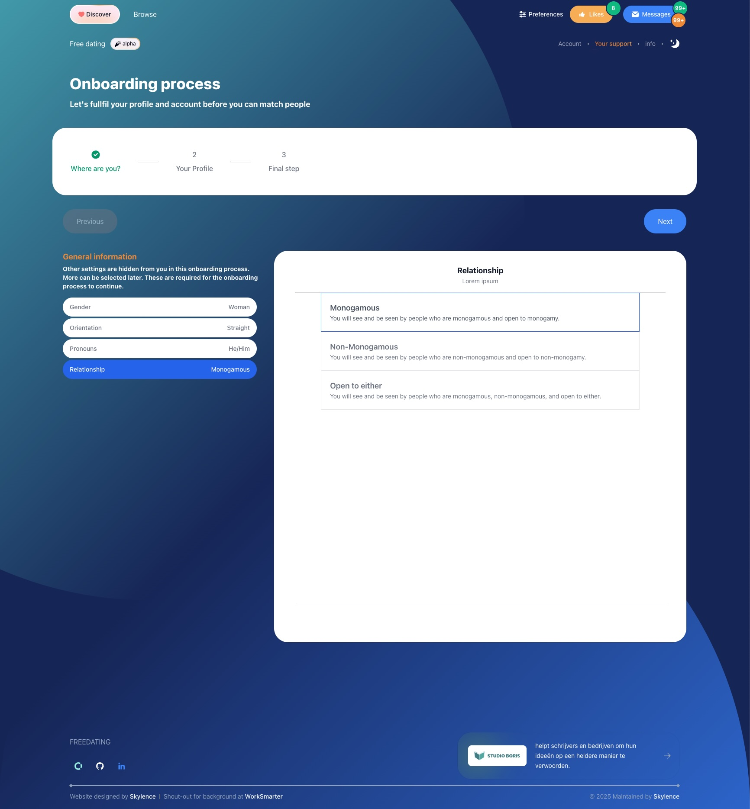
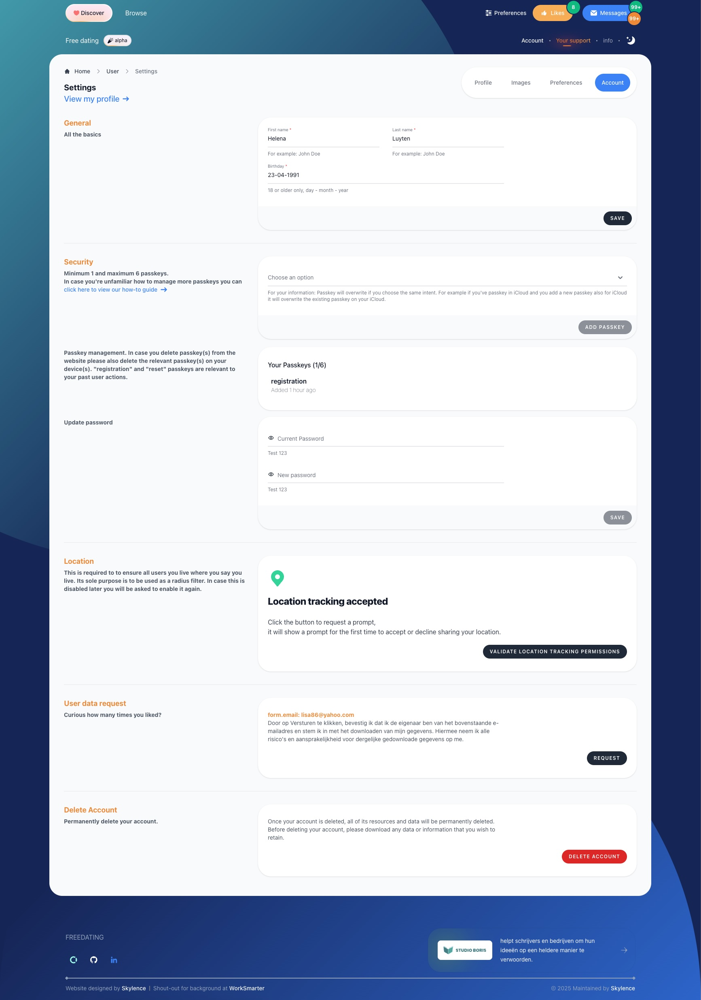
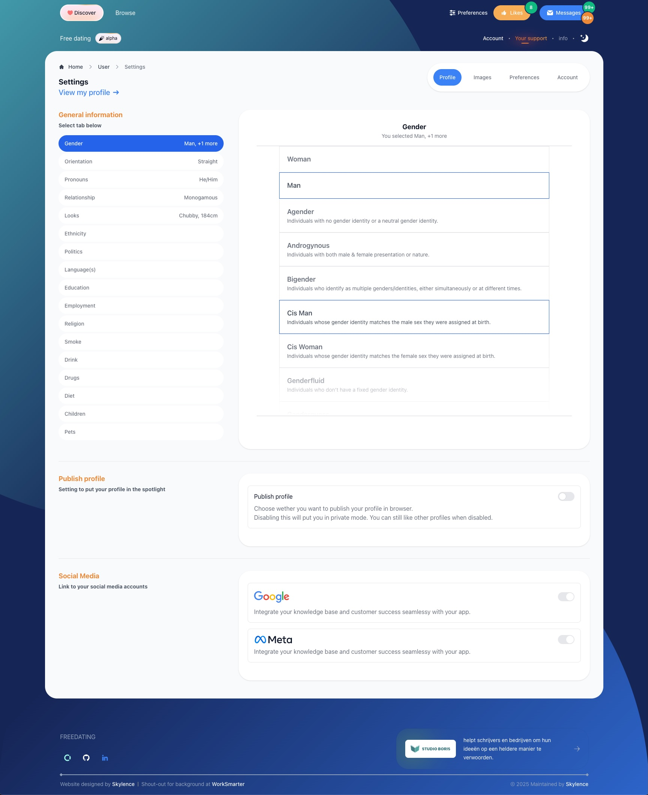

> [!WARNING]
> These are not final yet, alpha version

#### Current homepage

Everything on this page works except for numbers on bottom. Planning to add simple steps

#### Login page

Everything on this page works with WebAuthn.

#### Registration page

Everything on this page works with user and WebAuthn registration of passkey.

#### Onboarding page

Everything on this process works but need to add something extra to middleware.

#### Settings > Account

Everything on this page works except for deleting account. (wip)

#### Settings > Profile

Everything on this page works except for social media connection (wip).

